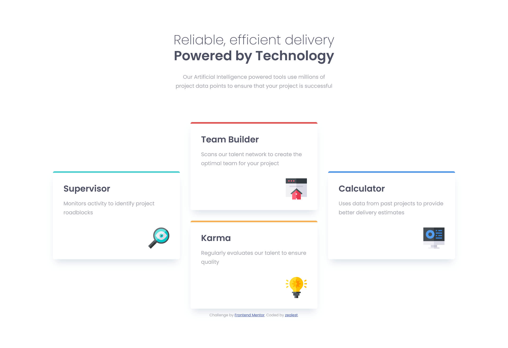

# Frontend Mentor - Four card feature section solution

This is my solution to the [Four card feature section challenge on Frontend Mentor](https://www.frontendmentor.io/challenges/four-card-feature-section-weK1eFYK).

## Overview

### The challenge

Users should be able to:

- View the optimal layout for the site depending on their device's screen size

### Screenshot

### Links

- Four card feature section challenge on [Frontend Mentor](https://www.frontendmentor.io/challenges/four-card-feature-section-weK1eFYK)
- [Live Site URL](https://zealest.github.io/__four_card_feature_section)

### Built with

- Semantic HTML5 markup
- CSS custom properties
- CSS Grid

This project makes use of semantic HTML5 markup for a clear and meaningful structure. CSS custom properties (variables) are employed to maintain a consistent design and facilitate easy theme adjustments. The layout is built using CSS Grid, providing a responsive and grid-based structure for optimal display on various devices.

## Author

- Frontend Mentor - [@Zealest](https://www.frontendmentor.io/profile/Zealest)
- Twitter - [@1zealest](https://www.twitter.com/1zealest)
